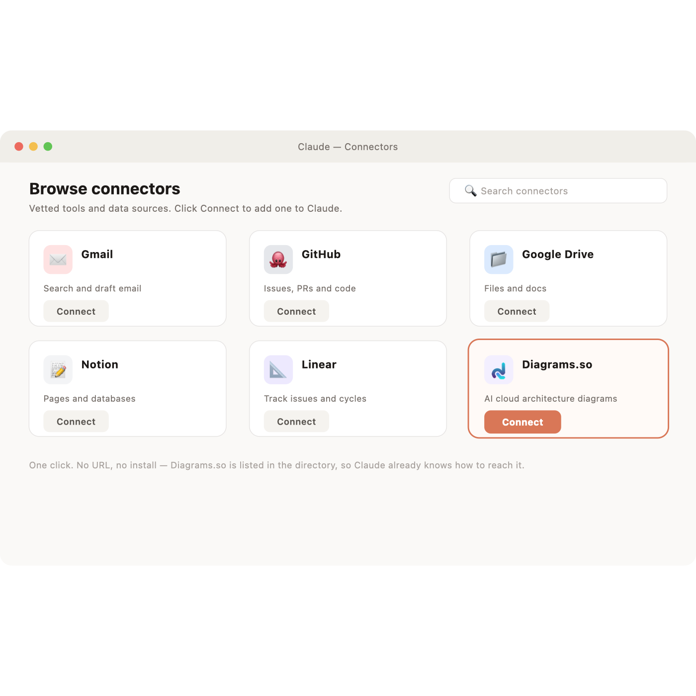
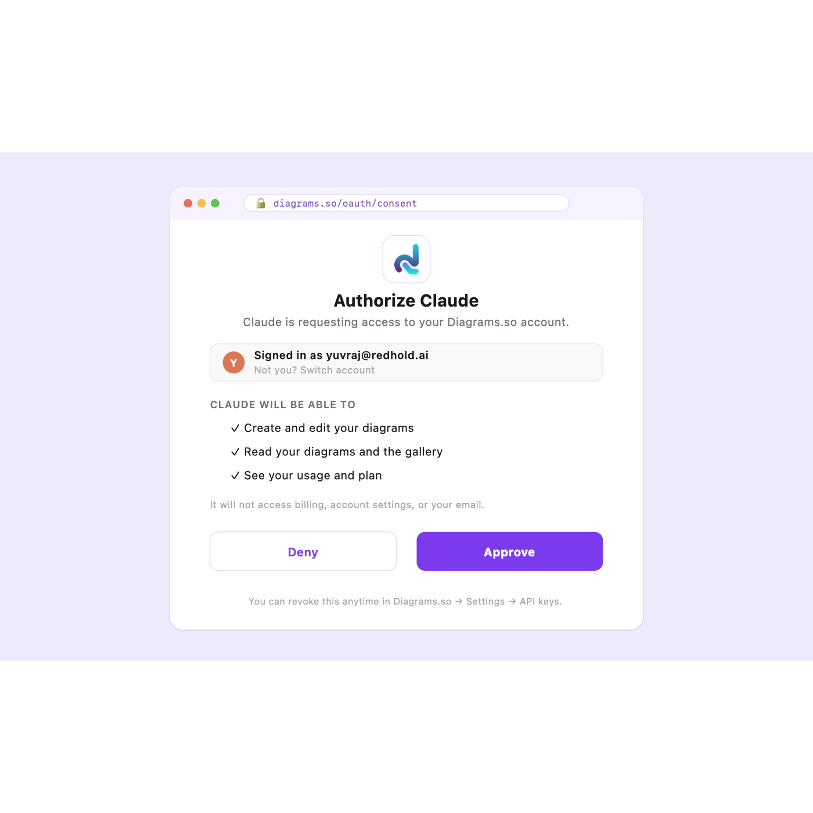
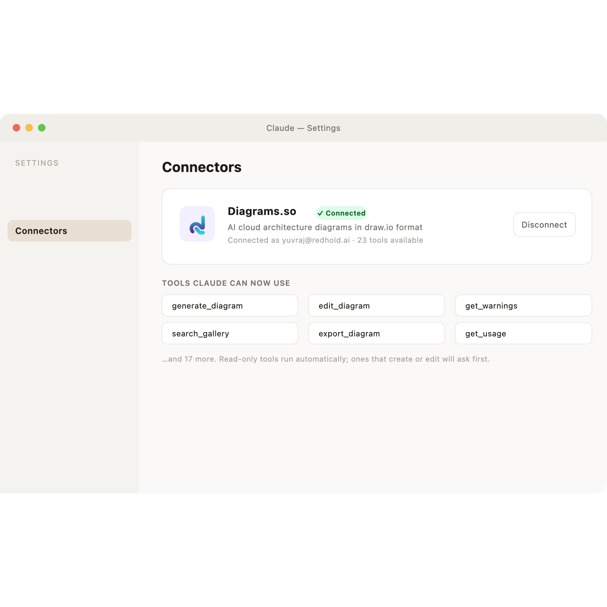
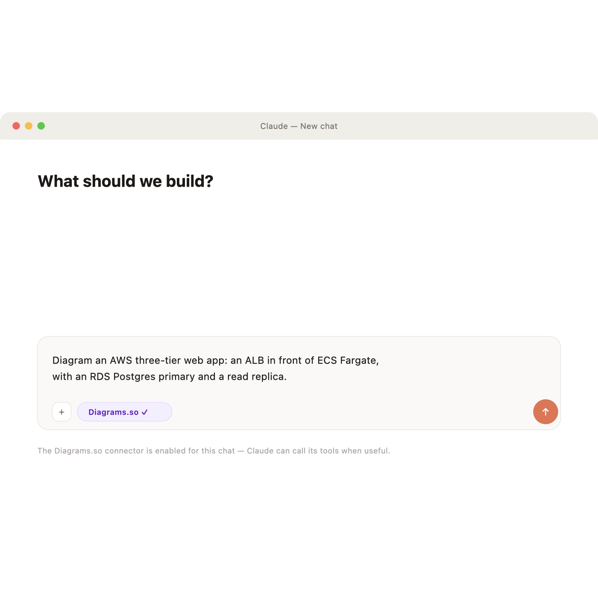
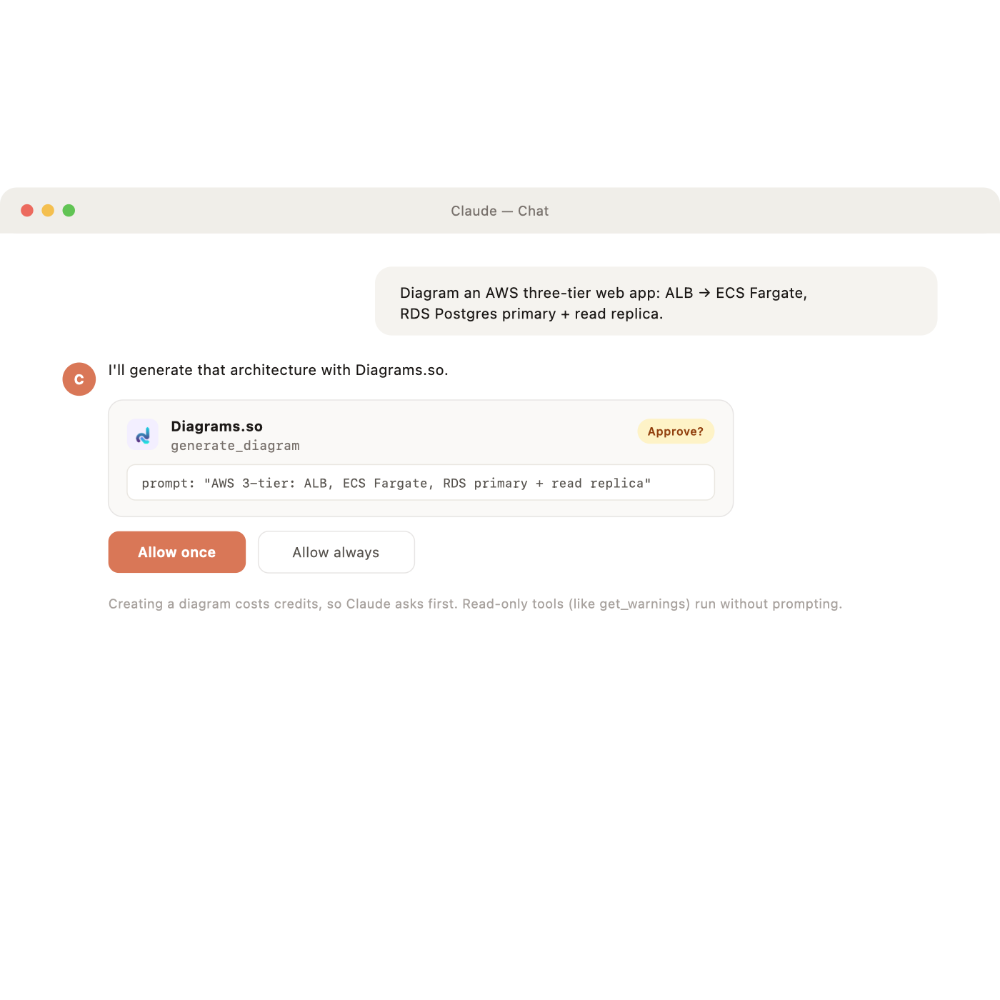
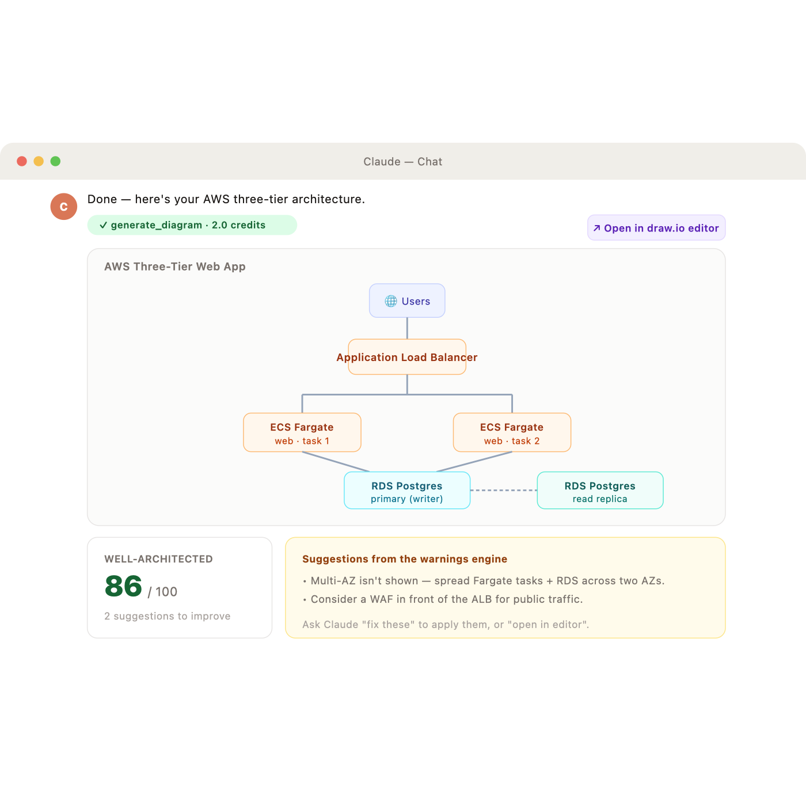

# Diagrams.so in Claude — the user experience

Screen-by-screen walkthrough of what a Claude user sees, from discovering the connector to getting an editable architecture diagram back. These are UI mockups of the intended experience (the connector isn't listed yet); each maps 1:1 to the flow the local harness proves end to end (401 → OAuth → scoped token → tool call → diagram).

The consent screen (Step 2) is the page this PR adds: `apps/web/src/app/oauth/consent`.

---

## Step 1 — Find it in Browse connectors → **Connect**
Diagrams.so appears in Claude's connector gallery. One click on **Connect** starts the flow (Claude hits the MCP server, gets `401 + WWW-Authenticate`, and opens sign-in).

## Step 2 — Sign in & approve (this PR's consent page)
A secure `diagrams.so/oauth/consent` window shows exactly what Claude will be able to do — and what it won't. Approve mints a scoped, revocable `dgz_` token via OAuth 2.1 auth-code + PKCE. Claude never sees a password.

## Step 3 — Connected
Back in Claude, Diagrams.so shows **✓ Connected** with 23 tools. Read-only tools run automatically; write tools ask first.

## Step 4 — Ask for a diagram in plain English
No special syntax — describe the architecture.

## Step 5 — Approve the tool call
Because generating costs credits, Claude asks before calling `generate_diagram`. The remote MCP server forwards this user's token to the API, so the work is billed to them.

## Step 6 — The diagram
Native draw.io (fully editable), a Well-Architected score, concrete suggestions, and the credits charged.

---

Full narrative version (prerequisites, plans/credits, test-vs-live, revocation, error states, go-live checklist): `~/Desktop/connector-ui-walkthrough/README.md`.
